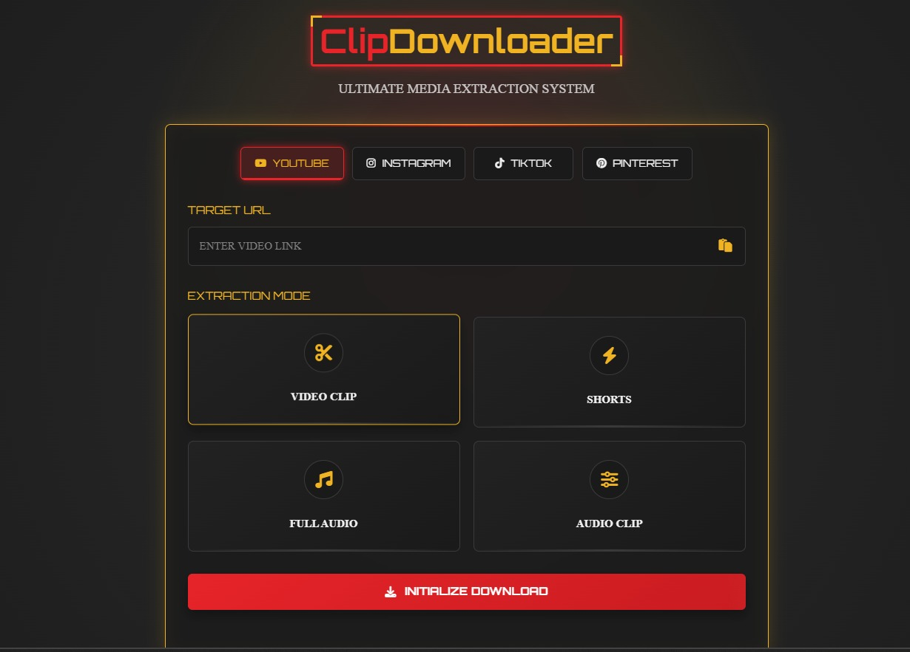

# ClipDownloader - Ultimate Media Extraction System



**ClipDownloader is a high-performance web application designed for downloading and clipping media from multiple platforms, including YouTube, Instagram, TikTok, and Pinterest. Built with a powerful Flask backend and a sleek, futuristic UI, it's the ultimate tool for media extraction.**

[](https://www.python.org/)
[](https://flask.palletsprojects.com/)
[](https://github.com/yt-dlp/yt-dlp)
[](https://opensource.org/licenses/MIT)

---

## ✨ Key Features

*   **Multi-Platform Support**: Download videos and audio from **YouTube, Instagram, TikTok, and Pinterest**.
*   **Advanced Clipping**: Precisely cut video or audio clips by specifying **start and end timestamps**.
*   **Multiple Extraction Modes**:
    *   Download full-length videos or shorts.
    *   Extract high-quality audio in MP3 format.
    *   Create video or audio clips from any part of the source media.
*   **Asynchronous Backend**: Downloads are processed in the background using a threaded task queue, so the UI remains responsive.
*   **Real-Time Progress Tracking**: The frontend polls the server to provide live feedback on download status and progress.
*   **Sleek "Iron Tech" UI**: A custom-designed interface built with **Tailwind CSS**, featuring a futuristic aesthetic, smooth animations, and an intuitive layout.
*   **Automatic Cleanup**: A built-in scheduler automatically removes temporary files and old downloads to save server space.
*   **Robust & Scalable**: Powered by the industry-standard `yt-dlp` library, ensuring compatibility with hundreds of websites and formats.

## 🛠️ Tech Stack & Core Libraries

| Category             | Technology / Library                                                                                                                                |
| -------------------- | --------------------------------------------------------------------------------------------------------------------------------------------------- |
| **Backend**          |                       |
| **Core Engine**      | `yt-dlp`, `FFmpeg`                                                                                                                                  |
| **Frontend**         |    |
| **Styling & Icons**  | `Google Fonts (Orbitron, Exo 2)`, `Font Awesome`                                                                                                    |
| **Architecture**     | Asynchronous Task Processing (Threading), REST API                                                                                                  |

---

## 🚀 Getting Started

To run ClipDownloader on your local machine, you will need Python, pip, and FFmpeg.

### 1. Prerequisites

*   **Python 3.8+**
*   **FFmpeg**: This is **essential** for clipping and audio conversion.
    *   Download FFmpeg from the [official website](https://ffmpeg.org/download.html).
    *   Place the `ffmpeg.exe` file in a known location.
    *   **Important**: Update the `ffmpeg_location` path in `app.py` to point to your `ffmpeg.exe` file.

    ```python
    # In app.py
    'ffmpeg_location': r'C:\path\to\your\ffmpeg.exe',
    ```

### 2. Clone the Repository

```bash
git clone https://github.com/Waqar-Hassan786/your-repo-name.git
cd your-repo-name
```

### 3. Install Dependencies

It's highly recommended to use a virtual environment.

```bash
# Create and activate a virtual environment
python -m venv venv
# On Windows:
venv\Scripts\activate
# On macOS/Linux:
source venv/bin/activate

# Install the required Python packages
pip install -r requirements.txt
```

### 4. Run the Application

Once the dependencies are installed and the FFmpeg path is correctly configured, run the Flask development server:

```bash
flask run
```

The application will be available at `http://127.0.0.1:5000`.

## ⚙️ How It Works

1.  **User Interface**: The user selects a service, enters a URL, and chooses an extraction mode (e.g., video clip).
2.  **API Request**: The frontend sends a POST request to the `/download` endpoint with the user's choices.
3.  **Backend Processing**:
    *   The Flask server receives the request and generates a unique `download_id`.
    *   It spins up a new background thread to handle the download, immediately returning the `download_id` to the user. This keeps the UI non-blocking.
    *   The background thread uses `yt-dlp` and `FFmpeg` to process the media according to the specified options (clipping, audio extraction, etc.).
4.  **Progress Polling**:
    *   The frontend uses the `download_id` to periodically poll the `/progress/<download_id>` endpoint.
    *   The server responds with the current status (`downloading`, `processing`, `completed`, `error`) and progress percentage.
5.  **File Download**: Once the status is `completed`, the frontend presents a download link pointing to `/downloads/<download_id>`, which serves the final processed file.

## 🤝 Contributing

Contributions are what make the open-source community such an amazing place to learn, inspire, and create. Any contributions you make are **greatly appreciated**.

1.  Fork the Project
2.  Create your Feature Branch (`git checkout -b feature/AmazingFeature`)
3.  Commit your Changes (`git commit -m 'Add some AmazingFeature'`)
4.  Push to the Branch (`git push origin feature/AmazingFeature`)
5.  Open a Pull Request

## 📄 License

Distributed under the MIT License. See `LICENSE` for more information.

---

**Built with passion by Waqar-Hassan786.**
